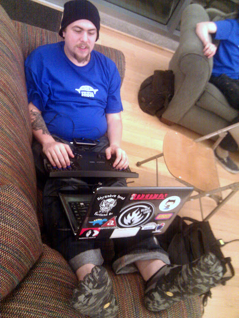

=================================================
The Resume of Wraithan, A Backend Developer
=================================================

    Open Source Bridge 2011.

Hi there, my legal name is Chris McDonald but I prefer `Wraithan
<http://wraithan.net/>`_. This is my web resume. If you are looking for a more
traditional one (may be out of date), you can find that `here
<https://github.com/wraithan/resume/blob/master/scannable_resume.pdf?raw=true>`_.

Who is he?

* A polyglot who enjoys the commonalities and contrasts of each
  programming language and platform.
* A native of Portland, OR, USA. (And is not looking to relocate)
* A performance and stability nut.
* A nerd, cyclist, and metal head.

I am a Node.js and Rust hacker. Though I have years of Python development
experience as well. I enjoy enabling more stable performant software in any way
I can.

In my spare time, I teach programming, play with hardware, and hack on side
projects. I subscribe to a statement I heard in one of the keynotes at PyCon
2012: "When programming stops being fun, I'll stop doing it."

#################
Table of Contents
#################

.. toctree::
    :maxdepth: 2

    about
    technical_skills
    other_skills
    projects
    gigs
    contact
